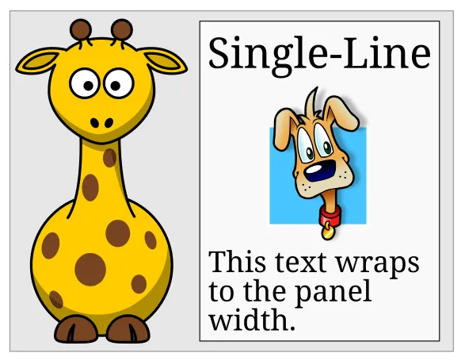
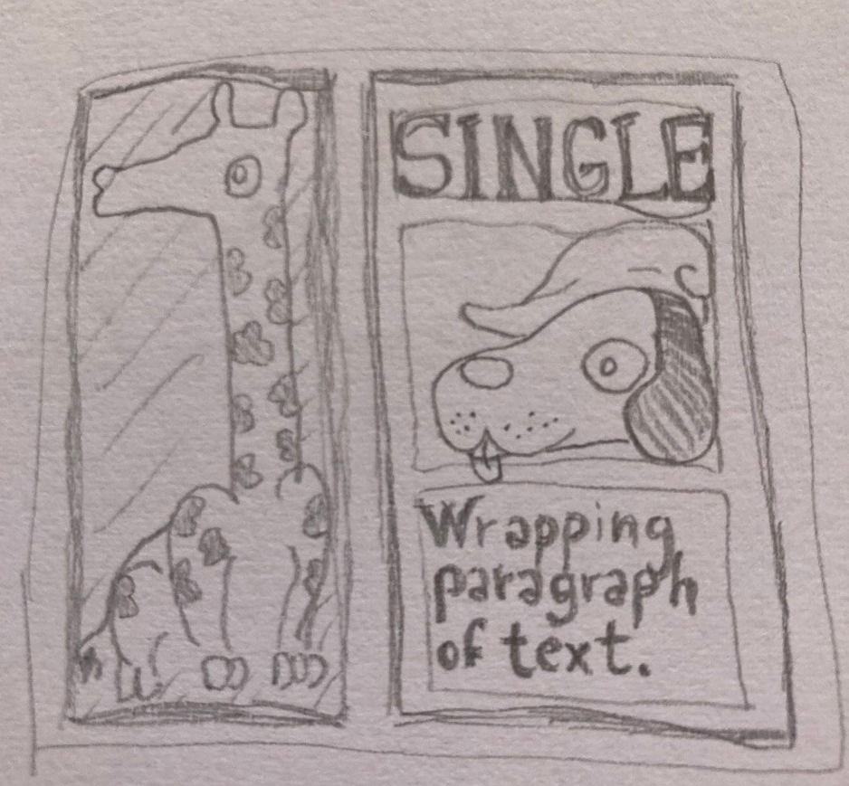
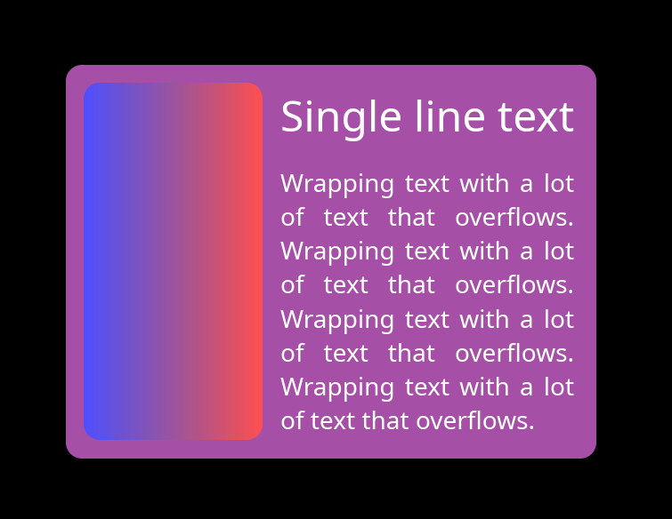

+++
title = "A New GUI Layout Algorithm?"
date = 2026-08-22
+++

This blog post is about the experimental layout system in Keru, my experimental GUI library for Rust. It uses a fairly unorthodox layout algorithm based on explicit dependencies between nodes.

When I first started writing Keru, I actually didn't have any strong opinions about layout, and I implemented a very simple system inspired by some blog posts describing the one in SwiftUI (it was 2024, so you couldn't just ask AI to write it). Unsurprisingly, it had some limitations, and I returned to layout some time later.

This time, I finally learned that GUI layout is more of an art than a science: a layout library offers some layout primitives that the user can compose, but when it comes to solving them into real rectangle coordinates, it usually makes no real promises. It's sort of common to do a fairly half-hearted attempt, give out an inconsistent answer, and declare that particular layout unsupported.

The enlightening example is this innocent-looking giraffe layout, taken from [this blog post by Edaqa Mortoray](https://mortoray.com/why_ui_layout_calculations_are_slow/):

<figure>
    
    <figcaption>You can ignore the dog, as it doesn't participate in the layout in any interesting way.</figcaption>
</figure>

In this layout, the multi-line paragraph fits to the width of the single-line label. The giraffe fits the height of the whole right section, and its width is half of its height, to preserve the aspect ratio of the bitmap image. As it turns out, most algorithms can't solve this.

The first thing I did was try to implement the `clay` algorithm in Keru, and I think I understood its algorithm well enough to conclude that it couldn't possibly solve this case.

I also did some experiments with CSS, and couldn't get it to solve it either. Because of how complicated CSS is, it's still entirely possible that a way to solve it exists, and I just didn't find the magic word that would make it happen. What I can say with certainty is that writing it in [the obvious way](@/css_giraffe.md) doesn't work: the giraffe stays at zero width.
 
[Edit: as it turns out, [there is a way to do it in CSS after all](@/css_giraffe_working.md), using vertical writing mode for the giraffe. But it's not very intuitive.  Thanks Nico Burns for pointing this out.]

To be clear, I don't think this is necessarily a huge problem: especially in the case of `clay` there's nothing wrong with sticking to a simpler and faster algorithm if it works for the intended application. There's plenty of GUI programs that work great without any advanced layouts of this kind and don't run into any of these issues.

However, it's not uncommon to hear people complaining about the unfriendliness of layout systems. If it was possible to find a more general solution that worked in a more consistent and predictable way without surprises, it might go a long way towards making the system feel more reliable and user-friendly.

My conclusion for now is that these limitations are due to the fact that most layout algorithms are implemented through a series of top-down or bottom-up tree traversals, and the dependencies in the giraffe example just don't line up with them. As the original giraffe blog post notes, solving an arbitrary dependency graph by doing multiple passes until everything is solved leads to exponential complexity, so the algorithms cut some corners. Sometimes doing a lot of memoization can help, but sometimes they just give up.

To understand what was going on, I tried drawing the giraffe on paper and asking myself what an ideal layout engine would do to solve this layout properly.

<figure>
    
    <figcaption>Again, you can ignore the dog.</figcaption>
</figure>

It turns out that in this case there's a pretty straightforward dependency chain:

- The single-line text determines the width of the v-stack on the right.
- The wrapping text fills the width of the v-stack, and determines its height by wrapping.
- The heights of the single-line text and the wrapping text sum up to determine the height of the h-stack.
- The giraffe fills the height of the h-stack, and determines its width by aspect-ratio.
- The widths of the giraffe and the v-stack sum up to determine the width of the outer panel.

## The Algorithm

It's not that hard to write an algorithm that goes through this chain in order.

The goal is to build a graph of dependencies, then solve it. In the simplest version of the algorithm, every element in the graph is a `(NodeID, Axis)` pair, and each dependency is an edge in the graph: `{ dependent: (NodeID, Axis), depends_on: (NodeID, Axis) }`.

- For each of these elements, we keep a list of elements that depend on it, and a count of elements it depends on.

    In practice, the list and the count can be stored directly on the UI node. Each UI node will have two, one for each axis.

- Do a full traversal of the UI tree:

    - For each node, compute the dependencies of both its axes based on its layout role. For example, if a node is `Fill` or `Fraction/Percent` on the `X` axis, then its `X` element depends on its parent's `X` element.

        Similarly, a `Fit` node depends on all its children. Stacks add some complication, but not much.

    - Note these dependencies into the dependent node's count and the depended node's list.

    - If the node has a determined size on an axis, such as a fixed size in `Pixels`, if it contains non-wrapping text, or if it is the root node with size `(1.0, 1.0)`, we also add that element to a solver queue.

- Then, go through the solver queue:

    - Solve the node's size. The initial elements can be solved trivially without dependencies.

    - Go through the solved node's list of dependents, and decrease the dependency count of that element by 1. If it reaches zero, push that element to the back of the solver queue.

- Continue until the solver queue is empty.

When you put it like this, it doesn't even sound that exciting, but it works. The single-line text is the starting point, and the solver steps through the chain exactly as we described above. Here is the solved giraffe:

<figure>
    
    <figcaption>The giraffe is replaced by a gradient, as I don't have an aesthetically consistent giraffe picture. But you can see, everything fits, and the giraffe has the correct aspect ratio.</figcaption>
</figure>

## Cycles

You might be wondering, "What about cycles?" That's a fair question to have when dealing with any sort of graph. But in practice they aren't much of a problem.

The first thing to keep in mind is that most expressive layout systems with primitives like `Fit`, `Fill`, `AspectRatio` etc. allow the user to express logical cycles, even if they are never materialized into a real cycle in a graph. When the CSS algorithm encounters such a cycle, it fills in some fairly arbitrary and inconsistent numbers, and moves on. The bar is not very high here.

On the other hand, with the graph algorithm, any node that wasn't reached by the solver is unsolvable due to cycles, so it's easy to set a flag, and run a second pass to recognize these nodes, log a warning, and collapse them to a fallback size or to zero.

The real weakness of the graph algorithm as described above is that it can make cycles "viral". Imagine a layout with two nodes that form a cycle, one plain node with a regular fixed size, and a node that depends on all of them (for example, a `Fit` container around all of them).

An algorithm that fills all of them with best-effort values won't have any good numbers for the two cycling nodes, but it might have a good guess for the container, based just on the plain node. The basic graph solver, on the other hand, will stop without solving the container, because it has dependencies that were never solved.

It's not hard to extend the graph algorithm to fix this, though. In short, we need to keep track of the elements that did get some useful input flowing into them, but whose dependency count never dropped to zero. After we're done with the main solver queue, we can take the first of these elements, collapse its unsolved dependencies to zero or to a fallback size, push them back onto the queue, and resume solving. Loop until there are no more of these "partially unsolvable" elements.

In this way, we can make sure that cycles don't mess up more of the layout than they have to.

The last observation is that most real occurrences of cycles come from fairly simple localized cycles, rather than long complicated chains.

So, we can reduce the occurrence of cycles by just forcing a hard-coded resolution to some of the more common cycle-like patterns. As an obvious example, we can decide that a node with `AspectRatio` on both axes should immediately resolve to `(100, 100)`, before even entering into the graph. We can also log a warning.

A more ambitious one is deciding that when a `Fit` node has only `Fill` children with no minimum sizes, the children can "punch through" the parent and fill the whole space of its *grand*parent. This is consistent with the idea of `Fit` acting as a neutral "margin" around its content, but I'll need to experiment with this for a while to see if it leads to too many surprising results.

## Different kinds of sizes

The next step in sophistication for the layout algorithm is to support maximum and minimum sizes. To do this, we expand the graphs: instead of a `(NodeID, Axis)` pair, every graph element is a triplet of `(NodeID, Axis, SizeType)`, where `SizeType` can be `Min`, `Max`, `Regular` or `Final`. Nodes with a min and max size on any axis will get all four elements, and the `Final` element will depend on all the other three.

When min and max sizes combine with some of the most complex cases of stack containers, this actually ends up complicating the picture quite a bit. Eventually, we also have to add some other kinds of more abstract `SizeTypes`, representing some partial calculations that the stacks have to do.

However, it turns out that the graph approach can deal with all of these complications, as long as we write down all the dependencies correctly. For this reason, I won't go into the details. If you are skeptical about this system's ability to solve any specific layout problem, let me know, and I will try it. You can also try it yourself and let me know how it goes: Keru is a pure Rust library and uses `winit` and `wgpu`, so trying it out should be relatively easy on most systems.  

## Data layout matters?

Keru is an experimental library that hasn't gone through any real-world testing, so there might still be many good reasons why you shouldn't do your layout like this after all. However, I was still surprised that I couldn't find anyone discussing an approach like this, even in blog posts or internet discussions.
The common wisdom just seems to be that layout algorithms are implemented with a series of tree-order traversals, usually with some memoization.

One exception is the old Cassowary constraint solver. It seems to have a bit of a bad reputation as an over-engineered historical oddity compared to the modern approaches, so it's probably fair to not consider it part of the current-day common wisdom. And in any case, its constraint system didn't look much like the dependency algorithm in Keru either.

Obviously there's no single answer for why things ended up like this, but it leads me to an interesting consideration about how the way in which the data layout of the tree may affect the choice of algorithms.

In the dark ages of programming, there was a common idea that the way to build a tree of nodes was to put each node in a separate heap allocation, and have the node's parent hold the pointer to it, because it "owns" it.

This means that a node is literally only accessible from its parent. In this situation, it's not surprising that most algorithms end up looking like a sequence of tree-order traversals!

In the style of programming that I use, on the other hand, all nodes are stored in a top-level container like a slotmap, slab, hashmap, or even a plain Vec in simpler cases. Then, nodes can refer to each other using non-owning `NodeID`s, which are indices or keys into the container.

This is what allows us to model dependencies as simple value structs that contain `NodeID`s, and to access and solve the nodes in arbitrary order when going through the dependencies.

More generally, the idea is to allow the programmer to always have a full bird's eye view on the whole state of the program, and to always have the freedom to access any of it. This is extremely helpful when experimenting with unusual algorithms or when debugging.

There are many other factors in this kind of decision, most importantly the impact on performance of using many separate allocations, and the loss of RAII on the other side. But this is an example that shows how a slotmap-based layout can actually improve the ergonomics, flexibility and understandability of the code as well.

## Performance

Layout is often considered to be a fairly slow part of a GUI library's pipeline, so it's natural to wonder about the performance of a new algorithm. 

From an algorithmic complexity point of view, Keru's algorithm doesn't have any major quadratic or exponential scaling on the global number of nodes, and it still boils down to the same per-node calculations, so it's reasonable to expect it to work "fine". Other than that, unfortunately I don't have a lot of useful information, as I didn't run any serious benchmarks.

However, I was still curious, so I ran some unserious ones, and compared the results with the ones from [this blog post from the PanGui project](https://www.pangui.io/blog/05-layout-rework-and-benchmarks/).

I should say immediately that Keru's current implementation of the algorithm is not optimized at all. I usually try to use the heap responsibly, and that's often enough to get pretty good performance without much effort. But in this case I broke my own rules and made each node hold a heap-allocated `Vec` with a list of the nodes that depend on it.
In addition, the layout algorithm runs on the full GUI nodes, which are huge structs containing a lot of information about the node's display, behavior, and other things completely unrelated to layout. Of course, this is not very cache friendly. This could be optimized, but to a certain level it's also an inherent disadvantage when comparing dedicated layout-only libraries with the performance of layout within a full library like Keru.

Another important thing to remember, of course, is that the Keru numbers were measured on a completely different CPU from the other ones. The Keru ones were run on an AMD Ryzen 7 5800H running on a laptop from 2021, which is probably a fair bit slower.

Despite all the caveats and the handwaving, it's still reassuring to see Keru's numbers being fairly similar to Yoga and Taffy:

### Total layout time

| Benchmark                  |   Nodes |      Taffy |       Yoga |       Keru |
|:---------------------------|--------:|-----------:|-----------:|-----------:|
| wide_no_wrap_simple_few    |   1,001 |  0.2507 ms |  0.1921 ms |  0.2286 ms |
| wide_no_wrap_simple_many   | 100,001 | 48.6879 ms | 28.5494 ms | 51.0822 ms |
| flex_expand_equal_weights  |  15,001 |  5.3728 ms |  4.8458 ms |  7.4206 ms |
| nested_vertical_stack      |  10,001 |  3.7867 ms |  2.9214 ms |  3.6699 ms |
| percentage_and_ratio       |  10,001 |  3.3133 ms |  2.9622 ms |  3.1916 ms |
| expand_with_max_constraint |   3,001 |  1.6222 ms |  1.6559 ms |  1.0274 ms |
| fit_nesting                | 101,111 |110.9751 ms | 60.0391 ms | 98.3934 ms |

### Time per node

| Benchmark                  |   Nodes |     Taffy |      Yoga |      Keru |
|:---------------------------|--------:|----------:|----------:|----------:|
| wide_no_wrap_simple_few    |   1,001 | 250.45 ns | 191.91 ns | 228.40 ns |
| wide_no_wrap_simple_many   | 100,001 | 486.87 ns | 285.49 ns | 510.82 ns |
| flex_expand_equal_weights  |  15,001 | 358.16 ns | 323.03 ns | 494.68 ns |
| nested_vertical_stack      |  10,001 | 378.63 ns | 292.11 ns | 366.96 ns |
| percentage_and_ratio       |  10,001 | 331.30 ns | 296.19 ns | 319.13 ns |
| expand_with_max_constraint |   3,001 | 540.55 ns | 551.78 ns | 342.36 ns |
| fit_nesting                | 101,111 |1097.56 ns | 593.79 ns | 973.12 ns |

If you clicked through to the blog post with the benchmarks, you might have noticed that the numbers for PanGui and for Clay are a full order of magnitude better than any of these! However, Clay uses a significantly less expressive algorithm, and PanGui is currently closed source, so there's not a lot to learn from the comparison.

Still, while being on par with Taffy and Yoga is "okay", it's true we should probably have higher standards for a new algorithm not encumbered by strict compliance with the CSS spec and written from scratch in the age of data-oriented programming. In the future, I'll try to see what an optimized version of the Keru algorithm can do.

## Thanks For Reading

That's all that I have to say about layout for now.

This layout system is one of the most interesting things I've worked on, but it's a fairly small and recent addition to Keru, which aims to be a full featured and usable GUI library. 

If you are interested, check out [Keru's Github page](https://github.com/kekelp/keru/), or the other posts in this blog.
