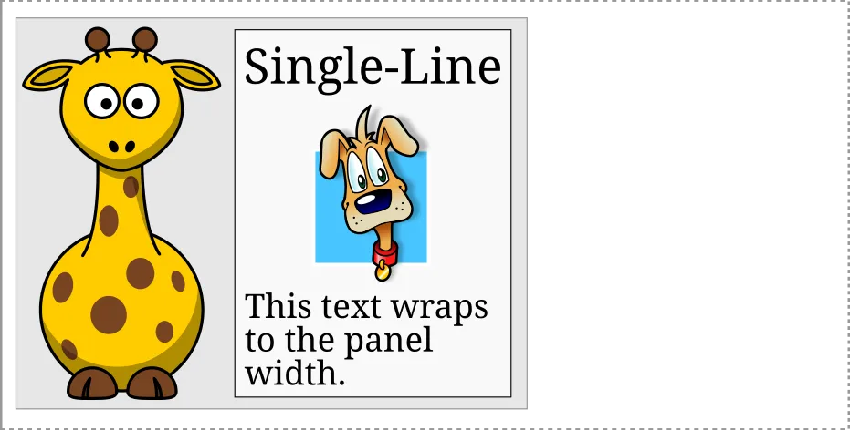

<!-- Keru new library

It's got to the point where people are almost annoyed when a new GUI library shows up, because they assume that it's low quality slop and shit, so rather than showing how simple the code for hello world is, I will start with a post about layout.

It uses a new dependency based algorithm for layout. It's better than what CSS and clay do, in the sense that the outputs are straight up better. CSS and clay layout are pretty limited and they just give up very easily when a moderately hard problem shows up.
Show the giraffe.

The dependency system is a much more general solution. -->

This blog post is about the layout system in Keru. It uses a fairly unorthodox layout algorithm based on explicit dependencies between nodes.

When I first started writing Keru, I actually had no strong opinions about layout, and I implemented a very simple system inspired by some blog posts describing SwiftUI's one (it was 2024, so you couldn't ask AI to vomit it out). Unsurprisingly, it had some limitations, and I returned to layout some time later.

This time, I finally discovered that layout is an art more than a science: a layout library offers some layout primitives that the user can compose, but when it comes to solving them and producing real rectangle coordinates, it's sort of common for libraries to do a fairly half-hearted attempt, give out a clearly inconsistent answer, and declare that particular layout unsupported. The example I found was innocent looking giraffe layout, from this blog post: https://mortoray.com/why_ui_layout_calculations_are_slow/

The multi-line paragraph fits to the width of the single-line label. The giraffe fits the height of the whole right section, and its width is half of its height, to preserve the aspect ratio of the bitmap image.

The first thing I did was trying to implementing the `clay` algorithm in Keru, and despite sabotaging myself with a lot of AI assistance, I think I understood its algorithm well enough to conclude that it couldn't possibly solve this case.

To be clear, I don't think this is necessarily a problem: especially in the case of `clay`, which is a library focused on performance and simplicity, there's nothing wrong with sticking to a simpler and faster algorithm, if it supports a wide enough set of simple cases. Maybe it could have a section on its site explaining which cases are supported and which aren't, but I don't blame them for not going through the effort of classifying it.

I also did some experiments with CSS layout, and concluded that it couldn't solve it either. This is a lot harder because of how incredibly complicated CSS is: it's still entirely possible that CSS can solve this problem just fine, and I just wasn't able to get it to work. However, my impression for now is that layout algorithms work by a series of top-down or bottom-up tree traversals, and the dependencies in the giraffe example just don't line up with the traversals 

## The structure of the tree

Keru is an experimental library that hasn't gone through any real-world testing, so there might still be many good reasons why you shouldn't do your layout like this after all. However, I'm still surprised that I couldn't find anyone discussing an approach like this in blog posts or internet discussions.

It seems that most layout algorithms end up being implemented with a series of tree-order traversals, usually with some memoization.

One exception is the old Cassowary constraint solver. It seems to have a bit of a bad reputation as an over-engineered historical oddity compared to the modern approaches, so it's probably fair to say that it's not part of the current-day common wisdom. And in any case, the constraint system didn't look much like the dependency algorithm in Keru either.

Obviously I don't have an answer for why this is, but it leads me to an interesting consideration about how the way in which the data layout of the tree may affect the choice of algorithms. In the dark ages of programming, there was a common idea that the way to build a tree of nodes was to put each node in a separate heap allocation, and have the node's parent hold the pointer to it, because it "owns" it.

This means that a node is literally only accessible from its parent. In this situation, it's not surprising that most algorithms end up looking like a sequence of tree-order traversals!

In the style of programming that I use, on the other hand, all nodes are stored in a top-level container like a slotmap, slab, hashmap, or even a plain Vec in simpler cases. Then, parent-child relationships are encoded by non-owning `NodeI`s, which are indices of keys into the container.

This is what allows us to model dependencies as simple `{ dependent: NodeI, depends_on: NodeI }` structs, and to access and solve the nodes in arbitrary order when going through the dependencies.

More generally, the idea is to allow the programmer to always have a full bird's eye view on the whole state of the program, and to always have the freedom to access any of it. This is extremely helpful when experimenting with unusual algorithms or when debugging.

There are many other factors in this kind of decision, most importantly the impact on performance of using many separate allocations, and the loss of RAII on the other side. But this is an example that shows how a slotmap-based layout can actually improve the ergonomics, flexibility and understandability of the code as well.
